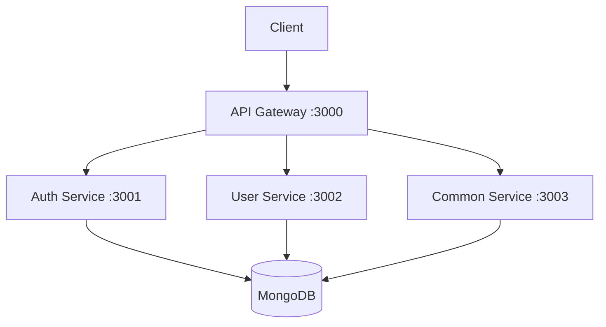

# GraphQL MongoDB Microservices

A production-ready microservices architecture using NestJS, GraphQL, and MongoDB.

## Architecture



## Services

- **API Gateway** (Port 3000): Routes requests to appropriate microservices
- **Auth Service** (Port 3001): Handles authentication, 2FA, and authorization
- **User Service** (Port 3002): Manages user data and operations
- **Common Service** (Port 3003): Provides shared utilities and services

## Prerequisites

- Node.js >= 18.0.0
- MongoDB
- Docker & Docker Compose (for production deployment)

## Quick Start

1. **Install Dependencies**
```bash
npm run install:all
```

2. **Development Mode**
```bash
# Start all services in development mode
npm run start:dev

# Start individual services
npm run start:auth    # Auth Service
npm run start:user    # User Service
npm run start:common  # Common Service
```

3. **Production Mode (Docker)**
```bash
# Build and start all services
npm run docker:build
npm run docker:up

# View logs
npm run docker:logs

# Stop services
npm run docker:down
```

## Available Scripts

### Development
- `npm run install:all` - Install dependencies for all services
- `npm run start:dev` - Start all services in development mode
- `npm run build:all` - Build all services
- `npm run test:all` - Run tests for all services
- `npm run lint:all` - Run linting for all services

### Docker Operations
- `npm run docker:build` - Build Docker images
- `npm run docker:up` - Start Docker containers
- `npm run docker:down` - Stop Docker containers
- `npm run docker:logs` - View Docker logs

### Maintenance
- `npm run clean:all` - Clean build files and node_modules
- `npm run lint:all` - Lint all services

## Service Endpoints

### Development URLs
- Auth Service: http://localhost:3001/auth/graphql
- User Service: http://localhost:3002/users/graphql
- Common Service: http://localhost:3003/common

### Production URLs (via API Gateway)
- Main Endpoint: http://localhost:3000/graphql

## Best Practices

1. **Service Independence**
   - Each service has its own database schema
   - Services communicate via well-defined APIs
   - No shared database access between services

2. **Security**
   - All services use helmet for security headers
   - CORS is properly configured
   - Authentication is centralized in Auth Service

3. **Monitoring & Logging**
   - Each service has its own logger
   - Health check endpoints are available
   - Docker logs are centralized

4. **Scalability**
   - Services can be scaled independently
   - Docker Compose for easy deployment
   - Environment-based configuration

5. **Development Workflow**
   - Consistent code style with ESLint
   - Automated testing with Jest
   - Clear separation of concerns

## Directory Structure

```
.
├── auth-service/       # Authentication service
├── user-service/       # User management service
├── common-service/     # Shared utilities service
├── docker-compose.yml  # Docker composition
├── package.json        # Root package file
└── README.md          # Documentation
```

## Contributing

1. Follow the established code style
2. Write tests for new features
3. Update documentation as needed
4. Use feature branches and pull requests

## License

ISC License